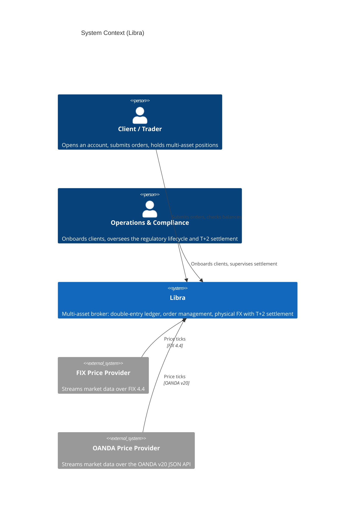
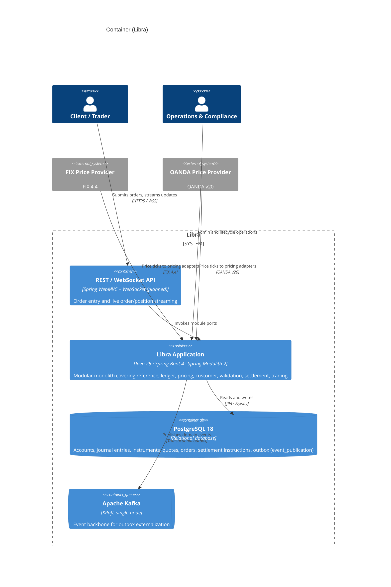
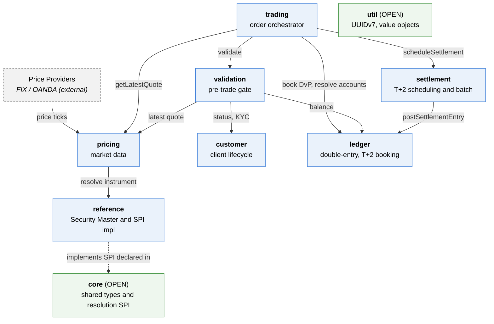
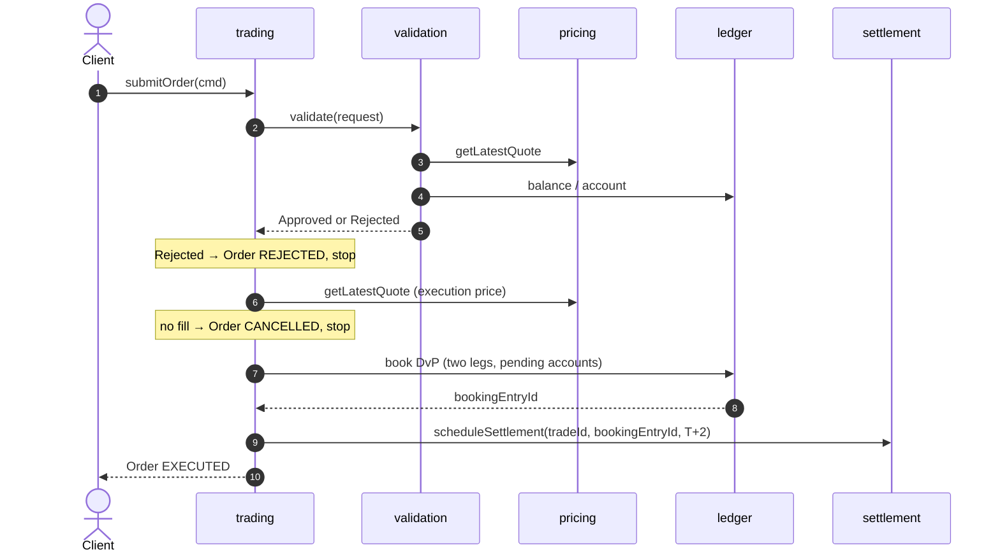

# Libra Architecture (C4 model)

This document describes Libra's architecture with the [C4 model](https://c4model.com): three
levels of zoom, namely System Context, Containers, and Components. Every diagram uses Mermaid, so
it renders on GitHub with no extra tooling. The structure lives here; the reasoning lives in the
decision records under [`docs/adr/`](./adr).

> Libra is a simplified multi-asset broker built as a portfolio project. Its differentiator is
> physical Forex with T+2 settlement, applied uniformly to equities (see
> [ADR-0003](./adr/0003-physical-forex-t2-uniform.md)).

---

## Architectural principles

Three principles shape every diagram and decision below. Each row points to where the principle
lives in the code and the record that justifies it, so an interviewer can verify the claim in
seconds rather than take it on faith.

| Principle | Where it lives in Libra | Recorded in |
|---|---|---|
| **Hexagonal (ports and adapters)** | Ports are the `*/port` service interfaces. Adapters are the inbound price clients (`pricing/client`, FIX and OANDA), the persistence layer (JPA repositories plus MapStruct mappers), and the planned REST/WebSocket API. The domain stays as pure records, isolated from infrastructure. | C4 Level 3 below; [ADR-0002](./adr/0002-named-interface-boundaries.md) |
| **Domain-Driven Design** | Bounded contexts are the modules. Aggregates: `JournalEntry`/`Account`, `Order`, `Customer`, `SettlementInstruction`. Value objects: `Money`, `Asset`, `CurrencyPair`. Domain events flow through the outbox. An anti-corruption layer keeps domain records separate from JPA POJOs. | [ADR-0006](./adr/0006-transactional-outbox.md), [ADR-0007](./adr/0007-anti-corruption-layer.md) |
| **SOLID** | SRP: ledger services are split per aggregate. OCP: the validation rule chain and sealed hierarchies extend without edits. LSP: exhaustive `switch` over the sealed `Asset`/`Instrument` types. ISP: narrow port interfaces. DIP: the resolution SPI is declared in `core` and implemented in `reference`. | [ADR-0008](./adr/0008-reference-resolution-spi.md), [ADR-0017](./adr/0017-validation-chain-of-responsibility.md) |

---

## Level 1: System Context

Who uses Libra and what it talks to.

Libra faces two human roles, a trading client and an internal ops/compliance role, plus two
external market-data feeds. Pricing is inbound and one-directional: the providers push ticks in,
and Libra never calls them back.

---

## Level 2: Containers

The deployable and runtime pieces. Libra runs as a modular monolith, one application process rather
than a fleet of services (see [ADR-0001](./adr/0001-modular-monolith.md)).

> The REST/WebSocket API is not built yet (the `api` module is planned). Every other container
> exists. Events reach Kafka through the transactional outbox (Spring Modulith); a module never
> calls a Kafka producer directly (see [ADR-0006](./adr/0006-transactional-outbox.md)).

---

## Level 3: Components

Zoom into the application: the Spring Modulith modules and the calls between them. Dependencies
point strictly downward (a higher module may call a lower one's published API, never the reverse),
which keeps the graph acyclic.

To keep the graph readable, the universally-shared edges are left out: `core` and `util` are
`OPEN` modules that any other module may use. The arrow from `reference` to `core` is dashed
because it is a dependency inversion. `reference` implements the resolution SPI that `core`
declares, so the compile-time arrow points up the layering on purpose
(see [ADR-0008](./adr/0008-reference-resolution-spi.md)).

### Declared module dependencies

Boundaries are enforced at build time by `ModularityTests` (`ApplicationModules.verify()`). Each
closed module publishes an `api` named interface over its `port`, `domain`, and `commands`
packages; consumers reference `module :: api` (see
[ADR-0002](./adr/0002-named-interface-boundaries.md)).

| Module | Type | `allowedDependencies` |
|---|---|---|
| `core` | OPEN | none (pure shared types and SPI) |
| `util` | OPEN | none |
| `reference` | closed | `core`, `util` |
| `ledger` | closed | `core`, `util` |
| `pricing` | closed | `core`, `util`, `reference :: api` |
| `customer` | closed | `core`, `util` |
| `validation` | closed | `core`, `ledger :: api`, `pricing :: api`, `customer :: api` |
| `settlement` | closed | `core`, `util`, `ledger :: api` |
| `trading` | closed | `core`, `util`, `ledger :: api`, `pricing :: api`, `validation :: api`, `settlement :: api` |

### The command path (one synchronous transaction)

`trading.submitOrder` is the convergence point. In a single transaction it walks down the graph:

Everything above runs synchronously. Three things stay asynchronous: the event fan-out (outbox to
Kafka), the time-triggered T+2 settlement batch, and the inbound price stream (see
[ADR-0009](./adr/0009-sync-command-async-fanout.md)).

---

## Level 4: Code

Left undrawn on purpose. At this scale the code-level structure (records for domain and value
objects, JPA POJOs for persistence, MapStruct between them) reads better from the source and from
[ADR-0007](./adr/0007-anti-corruption-layer.md) than from a diagram that would rot on every commit.

---

## Decision records

The reasoning behind every choice above is captured as MADR-format ADRs in [`docs/adr/`](./adr).
Start with the index at [`docs/adr/README.md`](./adr/README.md).
